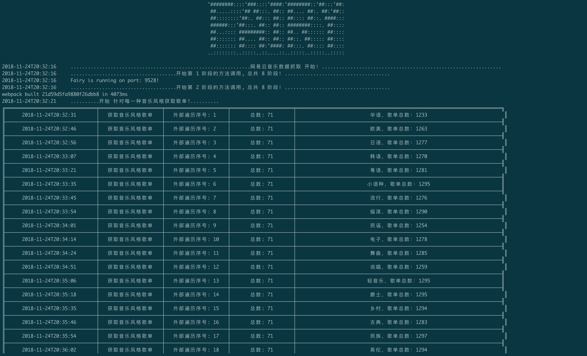
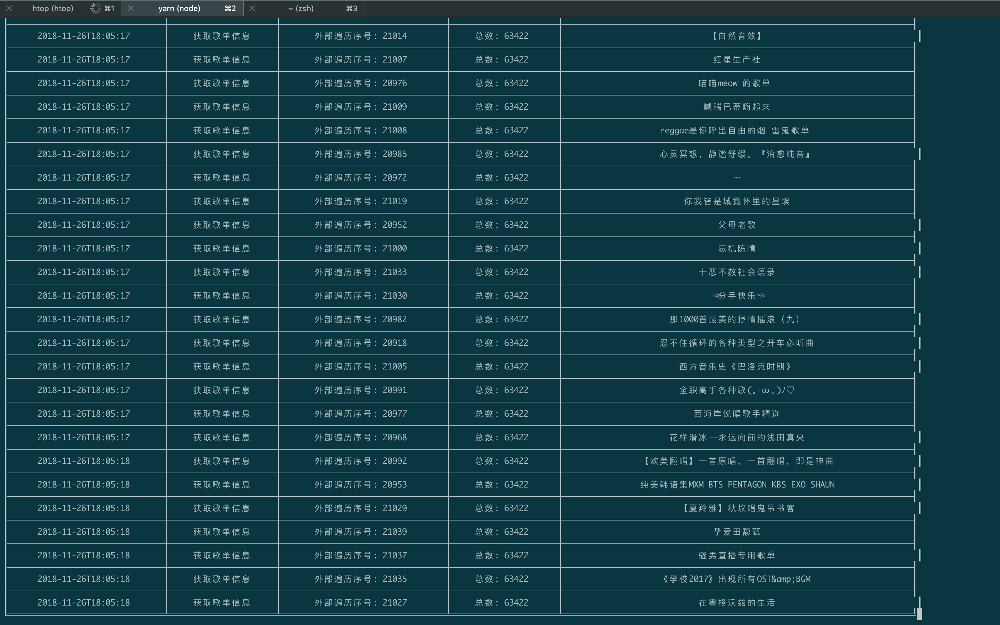
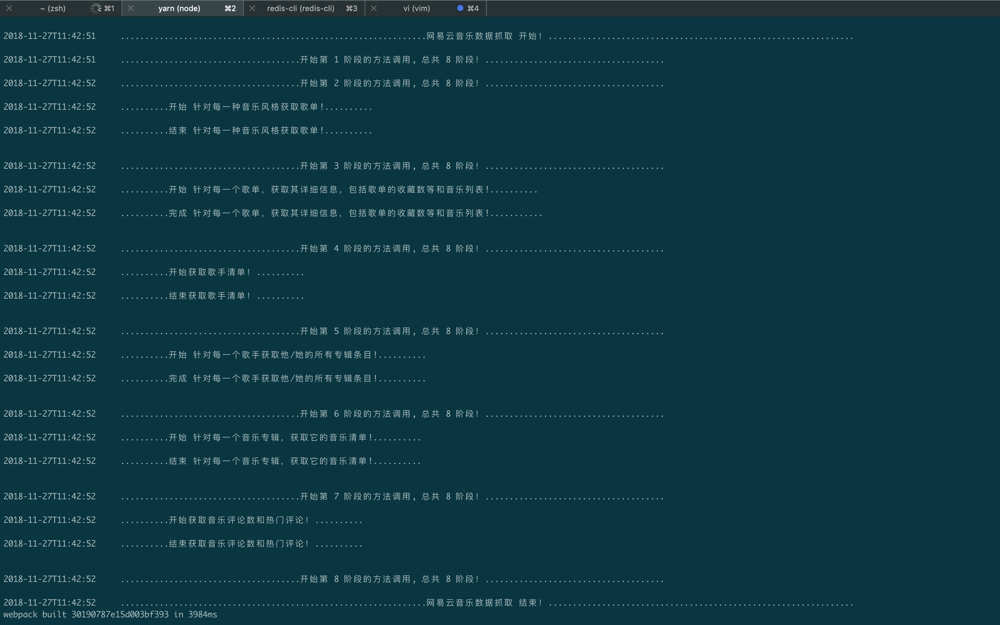
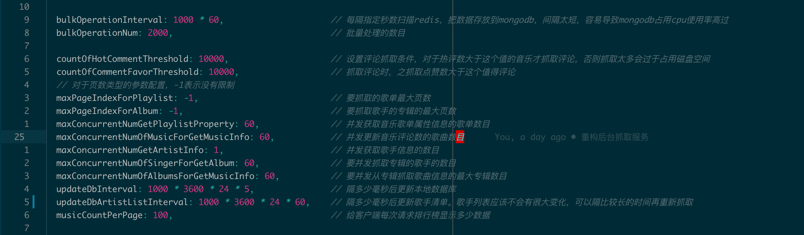
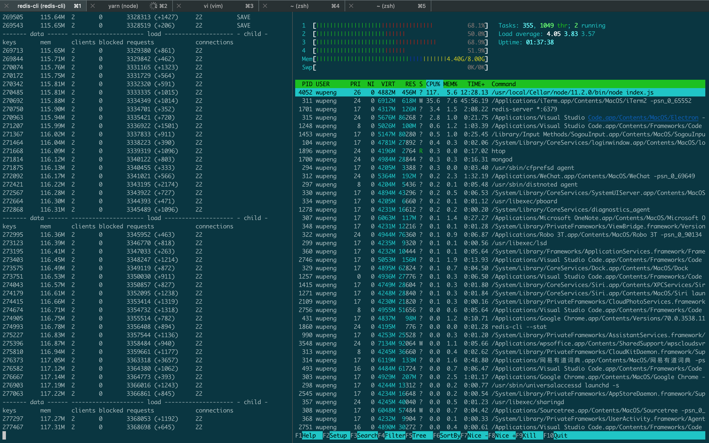

Icon made by [Freepik](http://www.freepik.com/)

# Fairy

## 原因

网易云音乐不缺乏各种商业性质的音乐排行榜，内容丰富，五花八门。从商业角度而言，这样很好。从用户角度而言，在某种程度上他们始终在被动地接受新的歌曲，然而新的歌曲不一定会是好的歌曲，既然歌曲本身质量不高，那么听这样的歌不就浪费时间了？

所以，我们要听经受得住时间考验的歌曲。有很多指标可以衡量歌曲是否优质，比如评论数是不是过万，热评点赞的人数多不多等等。对于歌单，我们可以以播放次数、评论次数、收藏次数等等作为是否优质的依据。我相信，过滤掉不符合条件的音乐或者歌单后，剩下的的就是经过大众认可的好东西。不否认，有的优质音乐评论数和热评数都很低，但是首先，要经过大众的认可才行。

最后，这个项目是我为了练手nodejs和react使用的，所以项目难免有bug或者不好用的地方。当然也在努力朝着产品化的方向发展。欢迎提出pull request，感谢之至！

##关于防屏蔽

更换ip，本来已经使用了一个提供http代理ip的代理池服务，发现几乎没有好用的ip。然后网易的防屏蔽并不太严重，如果抓不到数据了，换个不同的ip或者等大概24小时，就可以继续爬了。

## 性能

没有具体测试，但是代码里可以设置更大的并发抓取数量。数值越大，性能越好。

## 启动

目前后台已经可以抓取网易云音乐的数据了，细节方面还在不断优化。前台还需要重构，这样可以看到不同的指标下音乐的排行榜。

出于网易有反爬虫措施的考虑，如果后台报了网络连接错误，直接忽略就行，或者ctrl-c中断程序然后重新运行```yarn start```，fariy会接着上次中断的地方继续抓取数据，而不会重复抓取。

下面是一些抓取数据时后台打印的日志：





这是全部抓取完数据再次运行后台打印的日志：



同时，代码里```./server/src/config/index.js```有关于抓取时并发量的设置，默认并发数是60。



数据抓取下来以后暂时是放在redis里的，可以看出系统负载压力还可以接受。



##贡献

欢迎提交代码，有问题可以建```issue```。
